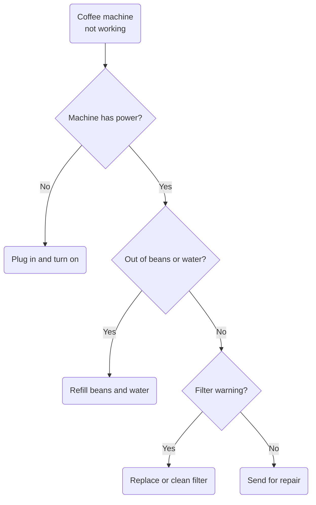

Title: 比特币的脚本语言
Slug: bitcoin-script-language
Date: 2023-02-26
Category: Blockchain
Tags: Blockchain
Status: draft

我们知道，在比特币的记账逻辑里面，一个核心的部分就是签名。“只有Alice对这笔交易进行签名，Bob才能使用这笔资金”。当我们用自然语言描述这段逻辑的时候，这听起来非常简答。但是当我们需要在一个不可新的环境里，由成千上万个参与者组成的P2P网络里面，安全地实现这一笔记账的时候，这就非常复杂了。为了解决这个问题，比特币引入了一种基于堆栈的脚本语言。本文将首先简单介绍比特币交易的结构，然后通过一个例子概述一笔通常的比特币转账是如何用脚本语言实现的，并介绍一些基本语法。最后，我们会拓展到比特币脚本语言的进阶应用。

# 比特币的基本结构

```text                         
    Transaction                                    
    +-------+-------+-----+-------+------+--------+
    |       |Input  |Input|Output |Output|        |
    |Version|Counter|UTXOs|Counter|UTXOs |Locktime|
    +-------+-------+-----+-------+------+--------+
                                                   
    Input UTXO              Output UTXO            
    +------+------+-------+ +------+------+---------+
    |      |Script|Locking| |      |Script|Unlocking|
    |Amount|Size  |Script | |Amount|Size  |Script   |
    +------+------+-------+ +------+------+---------+
```

每一笔比特币交易都遵循一个特定的数据结构，其结构可以概括为以下几个部分。
1. 版本号：标识比特币交易的版本，用于区分不同的交易格式。
2. 输入UTXO[ref]Unspent Transction Output 未花费交易输出[/ref]列表：由多个输入组成，每个输入都引用了之前交易中的某个输出。每个输入包含一个交易哈希值和输出索引，用于标识所引用的前一笔交易输出的位置，还有一个解锁脚本（ScriptSig），用于证明该交易的控制权。
3. 输出UTXO列表：由多个输出组成，每个输出都指定了一定数量的比特币发送给一个比特币地址。每个输出包含一个加密的脚本（ScriptPubKey），用于验证比特币的接收方是否有权花费这些比特币。
4. 锁定时间戳：用于控制交易的有效期，可以为0或者大于0。


This is some mermaid example

```mermaid
line-chart csv
col1,col2,=A1+B1
a,b,=A2+B2
d,e,=A3+B3
,,=sum(C:C)
```

----
